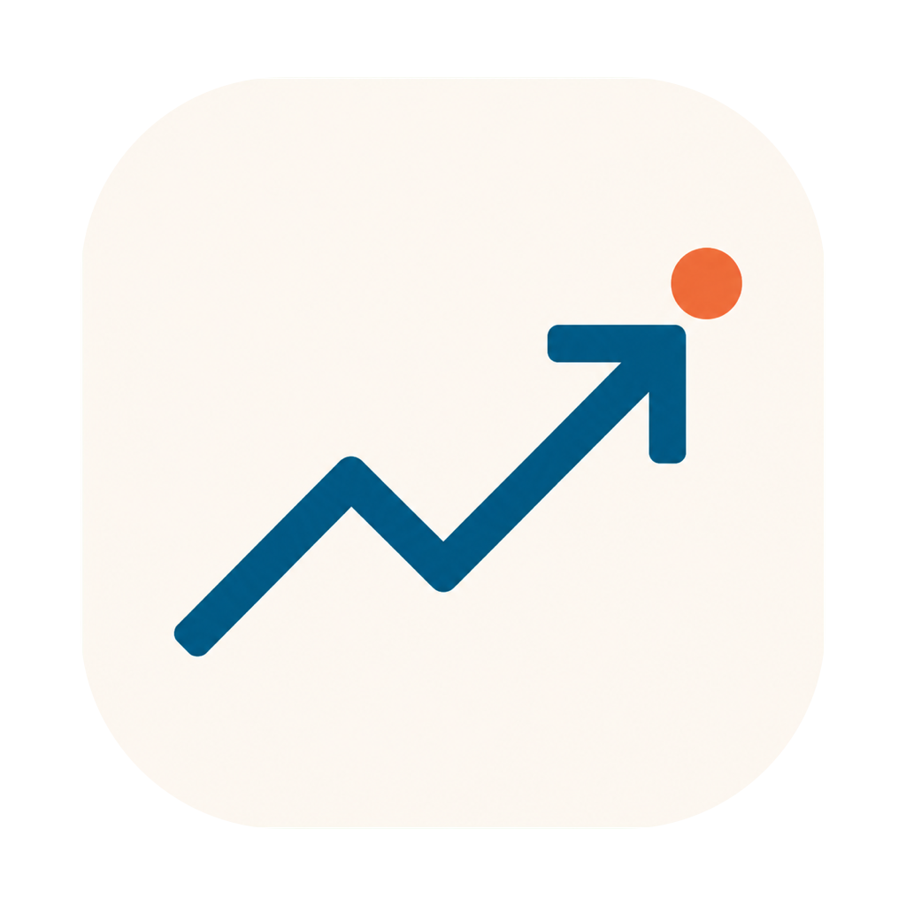
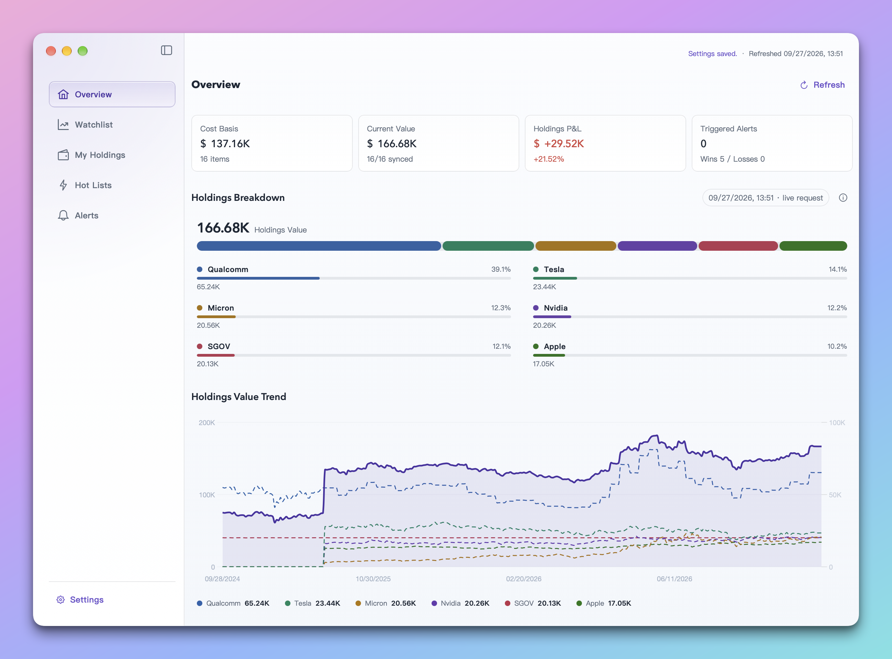
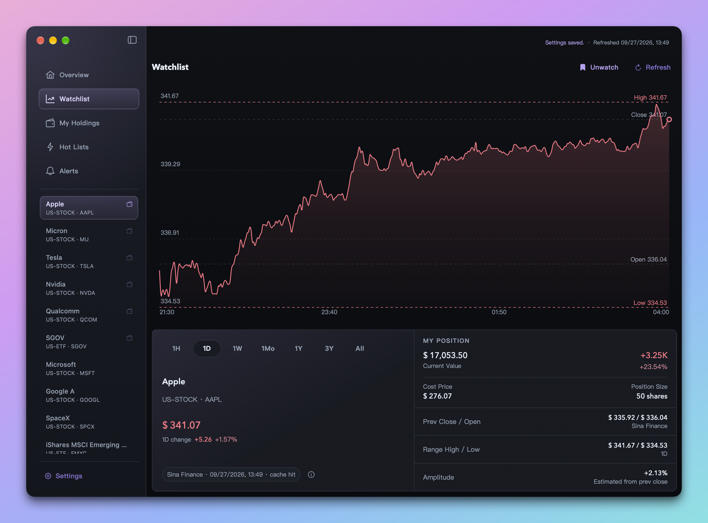

<div align="center">
  
</div>

<h1 align="center">InvestGo</h1>

[English](./README.md) | [简体中文](./README.zh-CN.md) | [License](./LICENSE)

A lightweight desktop investment workbench for watchlists, holdings, portfolio analytics, market data, and price alerts.





## Tech stack

- Go 1.24 and Wails v3 alpha.54
- Vue 3, TypeScript, PrimeVue, Vite, and Chart.js
- Multiple market-data providers with Frankfurter for FX rates

## Quick start

Requirements: Node.js 20+, pnpm 11+, Go 1.24+. macOS builds require macOS 13+; Windows builds require WebView2 Runtime.

```bash
pnpm install
pnpm dev
```

Run checks and build the frontend:

```bash
pnpm typecheck
env GOCACHE=/tmp/go-build-cache go test ./...
pnpm build
```

## Package and release

Pushes and pull requests run typecheck and Go tests. To produce installers, push a version tag:

```bash
git tag v0.3.0
git push origin v0.3.0
```

GitHub Actions then builds the Apple Silicon DMG, Intel DMG, and Windows `.exe`, and attaches them to a GitHub Release. You can also run **Release** from the Actions tab without creating a tag; artifacts stay on that workflow run.

To package locally instead:

```bash
VERSION=1.0.0 ./scripts/package-darwin-aarch64.sh   # Apple Silicon
VERSION=1.0.0 ./scripts/package-darwin-x86_64.sh    # Intel
```

```powershell
.\scripts\build-windows-amd64.ps1
```

Use `--dev` with the macOS scripts when Web Inspector support is needed. Outputs go to `build/bin/`. Windows currently produces a runnable `.exe`; an installer is not included yet.

## Notes

- Wails v3 is still in alpha, so APIs and packaging details may change.
- Public macOS builds are unsigned. If macOS blocks a trusted app, first try **Open Anyway** in System Settings > Privacy & Security. If it still cannot open, run:

    ```bash
    xattr -dr com.apple.quarantine /Applications/InvestGo.app
    ```

    Use `sudo xattr -dr com.apple.quarantine /Applications/InvestGo.app` if permission is denied, and only run this for an app you trust.

- This is primarily a personal-use and learning project. Market data may be delayed, incomplete, or unavailable, and the app does not provide investment advice.

## License

[MIT License](./LICENSE)
